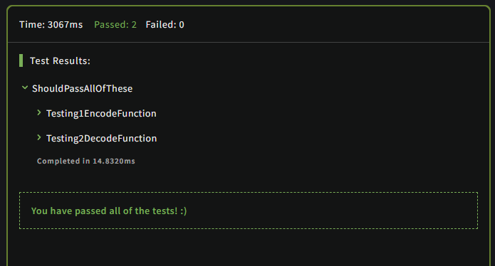
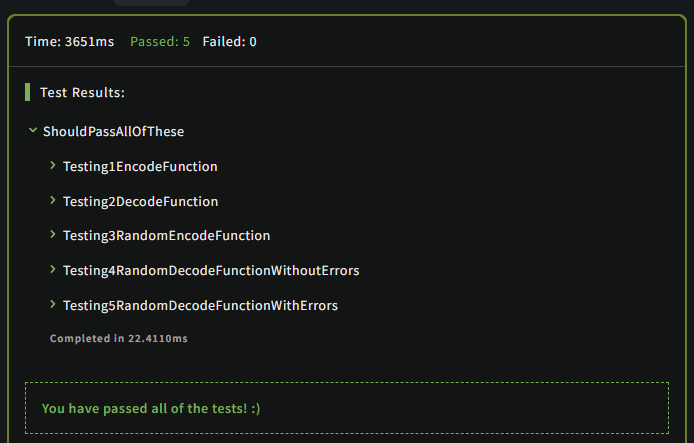
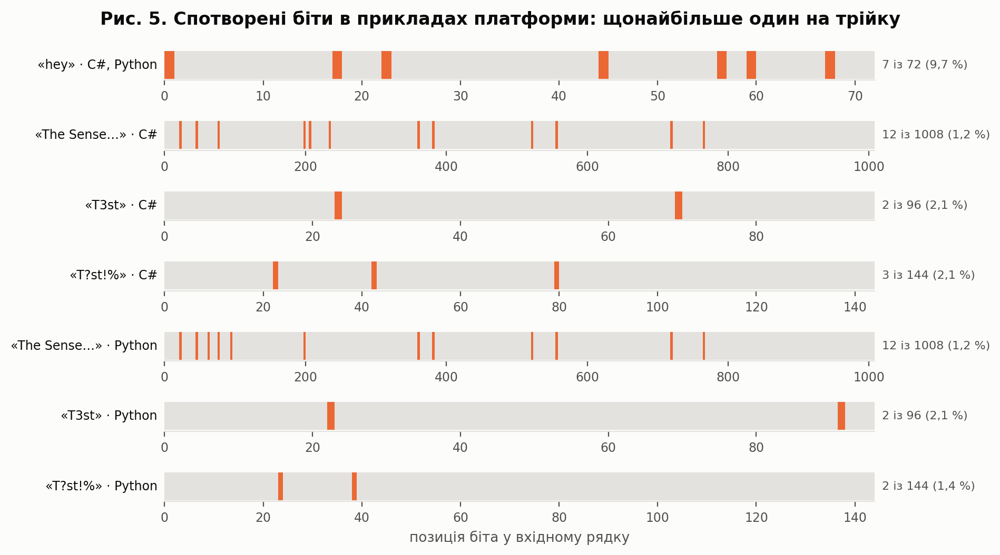
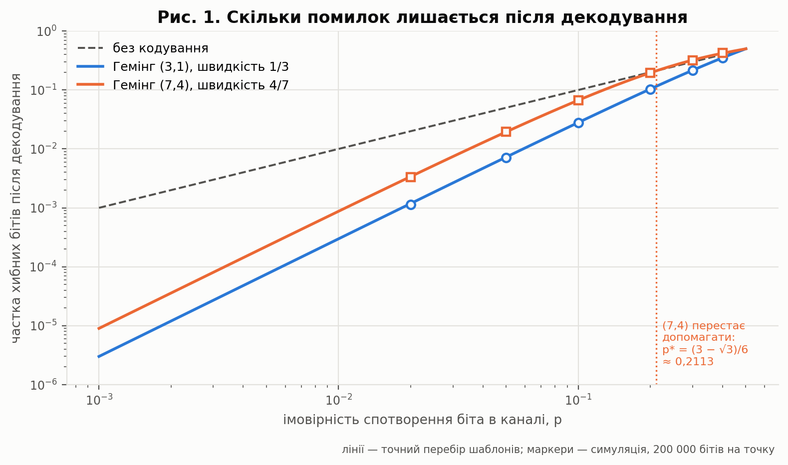
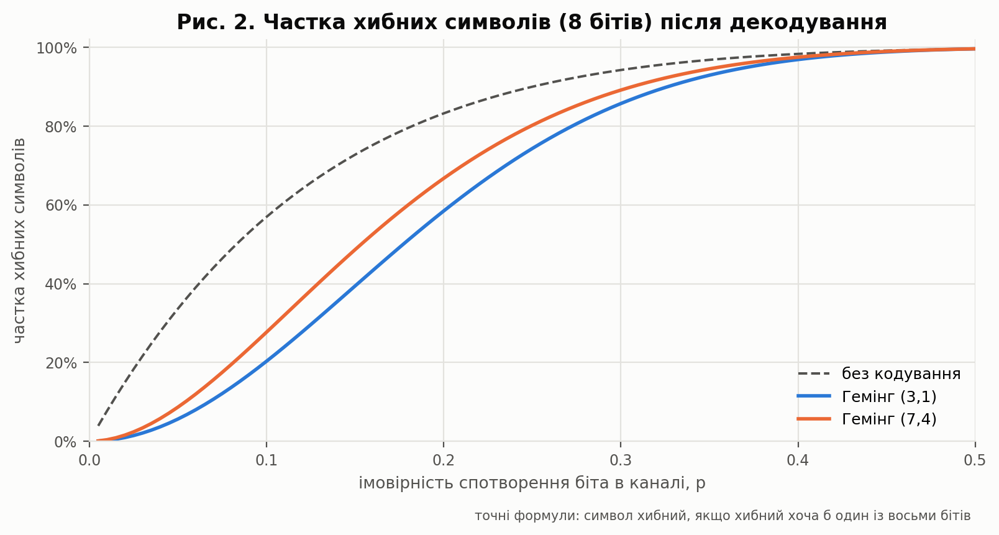
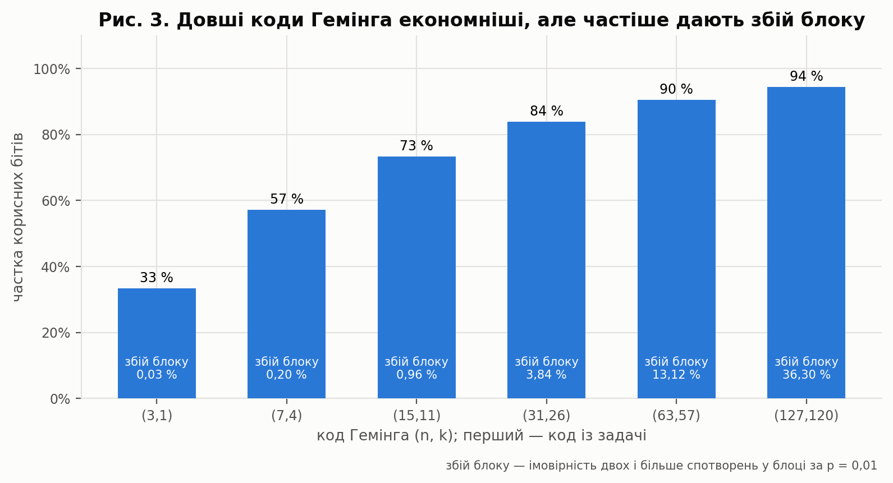
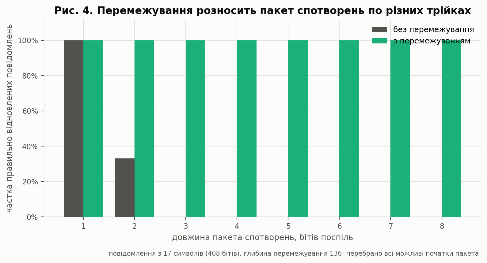

<div align="center">

# Лабораторна робота №6 — Error correction #1: Hamming Code

### Завадостійке кодування: код Гемінга (3,1) та його межі

[](https://github.com/RE22GDV/LR6-Hamming/actions/workflows/ci.yml)


**Код виправляє шум — але не підміну.**

</div>

---

## Зміст

1. [Мета та постановка задачі](#1-мета-та-постановка-задачі)
2. [Чому це саме код Гемінга](#2-чому-це-саме-код-гемінга)
3. [Розв'язок](#3-розвязок)
4. [Структура репозиторію](#4-структура-репозиторію)
5. [Швидкий старт](#5-швидкий-старт)
6. [Верифікація](#6-верифікація)
7. [Дослідження](#7-дослідження)
8. [Висновки](#8-висновки)
9. [Джерела](#9-джерела)

---

## 1. Мета та постановка задачі

Задача взята з Codewars (6 kyu) — **Error correction #1 - Hamming Code**.
Потрібно реалізувати дві функції:

- **`Encode(text)`** — кожен символ перетворити на 8-бітний ASCII-код,
  кожен біт повторити тричі й склеїти результат;
- **`Decode(bits)`** — розбити вхід на трійки, у кожній узяти біт, що
  трапляється частіше (`010 → 0`, `110 → 1`), зібрати байти й повернути
  текст.

Спотворення — лише інверсії бітів, без втрат, а довжина входу завжди
кратна 24 (8 бітів × 3 повтори).

```
"hey" → 104, 101, 121 → 01101000 01100101 01111001
      → 000111111000111000000000 000111111000000111000111 000111111111111000000111
```

---

## 2. Чому це саме код Гемінга

В умові потроєння названо «спрощеним алгоритмом Гемінга». Насправді це
**точно код Гемінга** — найменший у сімействі. Коди Гемінга мають параметри

```
n = 2^r − 1,   k = n − r,   мінімальна відстань 3
```

де `r` — кількість перевірних бітів. За `r = 2` маємо `n = 3`, `k = 1`:
один інформаційний біт і два перевірні, тобто кодові слова `000` і `111`.
Голосування більшістю для нього збігається із синдромним декодуванням.

| r | Код (n, k) | Швидкість k/n | Виправляє |
|---:|---|---:|---|
| **2** | **(3, 1)** — код із задачі | **33 %** | 1 помилку в блоці |
| 3 | (7, 4) — класичний | 57 % | 1 помилку в блоці |
| 4 | (15, 11) | 73 % | 1 помилку в блоці |
| 5 | (31, 26) | 84 % | 1 помилку в блоці |

Усі вони виправляють одну помилку на блок; відрізняються лише тим, скільки
корисних бітів несе блок.

---

## 3. Розв'язок

Розв'язок для Codewars — [`solution/CodeWars.cs`](solution/CodeWars.cs).

```csharp
public static string Encode(string text)
{
    var bits = new StringBuilder(text.Length * 24);
    foreach (char symbol in text)
    {
        // Convert.ToString(value, 2) відкидає провідні нулі ('h' -> "1101000"),
        // тому код доповнюється зліва рівно до 8 двійкових цифр.
        string octet = Convert.ToString((int)symbol, 2).PadLeft(8, '0');
        foreach (char bit in octet)
            bits.Append(bit, 3);          // 0 -> 000, 1 -> 111
    }
    return bits.ToString();
}

public static string Decode(string bits)
{
    var text = new StringBuilder(bits.Length / 24);
    for (int start = 0; start < bits.Length; start += 24)   // 24 = 8 бітів × 3
    {
        int value = 0;
        for (int j = 0; j < 8; j++)
        {
            int k = start + 3 * j;
            int ones = (bits[k] - '0') + (bits[k + 1] - '0') + (bits[k + 2] - '0');
            value = (value << 1) | (ones >= 2 ? 1 : 0);    // голосування більшістю
        }
        text.Append((char)value);
    }
    return text.ToString();
}
```

Без `PadLeft(8, '0')` символи з кодом менше 128 давали б 7 і менше бітів,
межі між символами зсувалися б, і декодування ламалося б.

### Той самий алгоритм на Python

Для порівняння — [`solution/codewars_solution.py`](solution/codewars_solution.py):

```python
def encode(string):
    # format(code, "08b") доповнює нулями рівно до 8 цифр:
    # ord("h") = 104 -> "01101000" (bin(104) дав би "0b1101000").
    return "".join(bit * 3 for char in string for bit in format(ord(char), "08b"))


def decode(bits):
    # Голосування більшістю в кожній трійці.
    data = "".join("1" if bits[i:i + 3].count("1") >= 2 else "0"
                   for i in range(0, len(bits), 3))
    # Кожні 8 виправлених бітів — один ASCII-код.
    return "".join(chr(int(data[i:i + 8], 2)) for i in range(0, len(data), 8))
```

| | C# | Python |
|---|---|---|
| Доповнення до 8 бітів | `Convert.ToString(c, 2).PadLeft(8, '0')` | `format(ord(c), "08b")` |
| Голосування | лічильник одиниць у трійці | `triple.count("1") >= 2` |
| Збирання байта | зсув `value << 1` | `int(bits, 2)` |
| Рядків коду | ~30 | 6 |

Алгоритм однаковий; Python-версія коротша за рахунок генераторних виразів,
C#-версія уникає проміжних рядків і працює з одним `StringBuilder`.

Складність — **O(n)** за часом і пам'яттю, де n — довжина рядка.

---

## 4. Структура репозиторію

```
LR6_Hamming/
├── solution/CodeWars.cs           Розв'язок для Codewars (C#)
├── solution/codewars_solution.py  Той самий алгоритм на Python
├── csharp/Hamming/                Самоперевірка того самого файлу (підключено без копіювання)
├── src/hamming/
│   ├── codes.py                   Коди (3,1) і (7,4)
│   ├── channel.py                 Шум, пакети спотворень, перемежування
│   ├── analysis.py                Точні ймовірності перебором шаблонів
│   └── cli.py                     Командний інтерфейс
├── tests/                         118 тестів, зокрема 11 прикладів Codewars
├── experiments/run_experiments.py Усі дослідження та рисунки
└── docs/
    ├── figures/                   Рисунки (+ pdf/ — версії без заголовків)
    └── results/                   experiments.json, summary.md
```

---

## 5. Швидкий старт

```bash
git clone https://github.com/RE22GDV/LR6-Hamming.git
cd LR6-Hamming
pip install -r requirements.txt
```

```bash
# Самоперевірка розв'язку на C#
dotnet run --project csharp/Hamming -- selftest
```

```bash
# Приклади Codewars на Python
python run.py selftest
```

```bash
# Передача через зашумлений канал
python run.py demo "Hello Bob" 0.05
```

```bash
# Підміна тексту без жодного сигналу від декодера
python run.py forge "pay 100" "pay 900"
```

---

## 6. Верифікація

### 6.1 Приклади платформи

Розв'язок на C# пройшов на Codewars і пробний прогін (2 тестові методи з
усіма вісьмома прикладами), і повний набір (5 методів, серед них три на
випадкових даних, зокрема декодування з помилками) — без жодної помилки.





Приклади Codewars збережено в
[`tests/codewars_cases.json`](tests/codewars_cases.json) разом із
позиціями спотворених бітів. Цікава деталь: входи для кодування в C#- і
Python-версіях kata однакові, а три з чотирьох **спотворених входів для
декодування різні** — тож у фікстурі 11 випадків, і обидва розв'язки
проходять усі.

| Функція | Вхід | Спотворено бітів | Результат |
|---|---|---:|:---:|
| Encode | `hey` | — | ✅ |
| Encode | `The Sensei told me that i can do this kata` | — | ✅ |
| Encode | `T3st` | — | ✅ |
| Encode | `T?st!%` | — | ✅ |
| Decode | 72 біти → `hey` | 7 (9,7 %) | ✅ |
| Decode | 1008 бітів → `The Sensei…` | 12 (1,2 %) | ✅ |
| Decode | 96 бітів → `T3st` | 2 (2,1 %) | ✅ |
| Decode | 144 біти → `T?st!%` | 3 (2,1 %) | ✅ |
| Decode (Python-версія) | 1008 бітів → `The Sensei…` | 12 (1,2 %) | ✅ |
| Decode (Python-версія) | 96 бітів → `T3st` | 2 (2,1 %) | ✅ |
| Decode (Python-версія) | 144 біти → `T?st!%` | 2 (1,4 %) | ✅ |



У «hey» спотворено майже кожен десятий біт — і текст однаково
відновлюється, бо в кожній трійці щонайбільше одне спотворення. Тест
`test_platform_corruptions_have_at_most_one_flip_per_triple` це перевіряє.

### 6.2 Тести

118 тестів, серед них:

- **приклади Codewars** — усі одинадцять з обох версій kata, для обох
  розв'язків, і окремо покроковий приклад з умови;
- **провідні нулі** — пробіл, `\0`, `\x7f` займають рівно 8 бітів;
- **межа можливостей** — будь-яке одне спотворення в кожній трійці
  виправляється, два спотворення в трійці дають хибний біт;
- **код (7,4)** — виправляє кожну одиночну помилку в кожному з 16 слів,
  мінімальна відстань дорівнює 3;
- **точні формули** — `3p² − 2p³` для (3,1) і `p²(9 − 26p + 30p² − 12p³)`
  для (7,4) збігаються з повним перебором шаблонів;
- **симуляція** — незалежно підтверджує формулу на 60 000 бітах;
- **перемежування** — пакет спотворень довжиною до глибини таблиці
  виправляється, довший — ні;
- **підміна** — двох інвертованих бітів досить, щоб «hey» стало «hex».

### 6.3 Перехресна перевірка

Консольний проєкт на C# підключає **той самий файл**, що надсилається на
Codewars, без копіювання. Тести порівнюють його й Python-розв'язок із
незалежною бібліотечною реалізацією на прикладах платформи та випадкових
спотвореннях.

```bash
$ python -m pytest -q
118 passed
```

---

## 7. Дослідження

Усі числа й рисунки отримано скриптом
[`experiments/run_experiments.py`](experiments/run_experiments.py).
Теоретичні криві обчислено **перебором усіх шаблонів спотворень** блоку
(8 для коду (3,1), 16 × 128 для (7,4)), тож це точні значення, а не оцінки.
Симуляція із фіксованим зерном слугує незалежною перевіркою.

### 7.1 Скільки помилок лишається після декодування



Модель каналу — двійковий симетричний: кожен біт незалежно інвертується з
імовірністю `p`. Біт коду (3,1) декодується хибно, якщо спотворено
щонайменше два з трьох повторів:

```
P_b(3,1) = 3p²(1 − p) + p³ = 3p² − 2p³
P_b(7,4) = p²(9 − 26p + 30p² − 12p³)
```

| p | без кодування | Гемінг (3,1) | Гемінг (7,4) |
|---:|---:|---:|---:|
| 0,001 | 0,001 | 0,000003 | 0,000009 |
| 0,01 | 0,01 | 0,000298 | 0,000874 |
| 0,05 | 0,05 | 0,007250 | 0,019434 |
| 0,1 | 0,1 | 0,028000 | 0,066880 |
| 0,3 | 0,3 | 0,216000 | **0,321840** |
| 0,5 | 0,5 | 0,5 | 0,5 |

Симуляція на 200 000 бітів на точку збігається з точними значеннями до
третього знака.

**Неочевидний результат.** Код (3,1) допомагає за будь-якого `p < 0,5`.
А код (7,4) допомагає лише за

```
p < p* = (3 − √3)/6 ≈ 0,2113
```

— це єдиний корінь рівняння `P_b(p) = p` на інтервалі (0; ½), отриманий
символьно. Правіше цієї точки декодування (7,4) **збільшує** частку хибних
бітів: за `p = 0,3` їх 32 % проти 30 % без кодування. Причина в тому, що
за двох спотворень у блоці синдром указує на третій, неспотворений біт, і
декодер «виправляє» його, додаючи помилку.

### 7.2 Помилки на рівні символу



Символ хибний, якщо хибний хоча б один із восьми бітів. За `p = 0,01`
без кодування хибних символів 7,73 %, з кодом (3,1) — 0,24 %, з (7,4) —
0,41 %.

### 7.3 Ціна надійності



Довші коди Гемінга несуть більше корисних бітів, але блок, у який
потрапили дві помилки, вже не виправляється — а в довгому блоці це
трапляється частіше. За `p = 0,01` імовірність збою блоку зростає від
0,03 % для (3,1) до 36 % для (127,120). Код із задачі — найнадійніший і
найдорожчий: він утричі збільшує обсяг даних.

### 7.4 Пакети спотворень і перемежування



Код виправляє одне спотворення **на трійку**. Імпульсна завада, що
спотворює кілька сусідніх бітів, потрапляє в одну трійку — і код безсилий.
Перебір усіх можливих позицій пакета для повідомлення з 17 символів:

| Довжина пакета | Без перемежування | З перемежуванням |
|---:|---:|---:|
| 1 | 100 % | 100 % |
| 2 | 33,2 % | 100 % |
| 3 і більше | 0 % | 100 % |

Пакет із двох бітів виправляється лише тоді, коли розрізає межу між
трійками (одна позиція з трьох). **Перемежування** розносить сусідні біти
по різних трійках: таблиця має по рядку на кожну трійку, а в канал іде
читання по стовпцях. Тоді пакет довжиною не більше за кількість трійок
(тут 136) зачіпає кожну трійку щонайбільше раз. Ціна — затримка: для
декодування потрібна вся таблиця.

### 7.5 Код виправляє шум, але не підміну

Для курсу із захисту даних це головний висновок. Декодер ніколи не
повідомляє про проблему: два спотворення в трійці він впевнено
«виправляє» в хибний біт. Тому зловмисникові досить інвертувати два біти
каналу на кожен біт тексту, який він хоче змінити.

| Оригінал | Підробка | Інвертувати бітів | Із | Частка |
|---|---|---:|---:|---:|
| `hey` | `hex` | **2** | 72 | 2,78 % |
| `pay 100` | `pay 900` | **2** | 168 | 1,19 % |
| `attack at 9` | `attack at 1` | **2** | 264 | 0,76 % |
| `YES` | `NO!` | 20 | 72 | 27,78 % |

`'1'` і `'9'` відрізняються одним бітом, тож сума платежу змінюється
інверсією двох бітів із 168, а декодер видає коректне з його погляду
повідомлення. Від навмисного втручання захищають інші засоби — коди
автентичності повідомлень (MAC) або цифровий підпис: вони не виправляють,
а **виявляють** зміну.

---

## 8. Висновки

У роботі реалізовано кодування й декодування з задачі «Error correction
#1 - Hamming Code» мовами C# і Python. Обидва розв'язки проходять приклади
обох версій kata — разом одинадцять, бо спотворені входи для декодування в
C#- і Python-версіях різні, — і покриті 118 тестами, серед яких точні
перевірки формул повним перебором шаблонів спотворень.

Потроєння біта з голосуванням більшістю — це не наближення до коду
Гемінга, а точно код Гемінга (3,1), найменший у сімействі з параметрами
(2ʳ − 1, 2ʳ − r − 1). Як і решта кодів Гемінга, він виправляє одне
спотворення на блок, але має найнижчу швидкість — один корисний біт із
трьох.

Залишкова частка хибних бітів для коду (3,1) дорівнює 3p² − 2p³, і код
допомагає за будь-якої ймовірності спотворення p < 0,5. Для порівняння,
класичний код (7,4) економніший, але допомагає лише за p < (3 − √3)/6 ≈
0,2113 — цю межу отримано символьно з полінома p²(9 − 26p + 30p² − 12p³),
— а за більших p декодування додає помилок замість виправлення. Симуляція
на 200 000 бітів на точку з точними значеннями узгоджується.

Сильна сторона коду — незалежні випадкові спотворення; слабка — пакети:
два сусідні спотворення в одній трійці вже дають хибний біт. Перемежування
усуває цю слабкість для пакетів, не довших за глибину таблиці, ціною
затримки на час заповнення таблиці.

Найважливіше для захисту даних: завадостійкий код не виявляє навмисної
зміни. Декодер ніколи не повідомляє про проблему, тож двох інвертованих
бітів із 168 досить, щоб «pay 100» перетворилося на «pay 900». Код
захищає від шуму, а від підміни потрібні засоби автентифікації — коди
автентичності повідомлень або цифровий підпис.

---

## 9. Джерела

1. Codewars. *Error correction #1 - Hamming Code* [Електронний ресурс]. –
   Режим доступу: https://www.codewars.com/kata/5ef9ca8b76be6d001d5e1c3e
2. Коди Гемінга [Електронний ресурс] // Вікіпедія. – Режим доступу:
   https://uk.wikipedia.org/wiki/Коди_Гемінга
3. Hamming R. W. Error Detecting and Error Correcting Codes // Bell System
   Technical Journal. – 1950. – Vol. 29, No. 2. – P. 147–160.
4. MacWilliams F. J., Sloane N. J. A. *The Theory of Error-Correcting
   Codes*. – Amsterdam: North-Holland, 1977.
5. Вихідний код роботи [Електронний ресурс]. – Режим доступу:
   https://github.com/RE22GDV/LR6-Hamming

---

<p align="center">
  <sub>Лабораторна робота №6 · Захист даних · 2026</sub>
</p>
